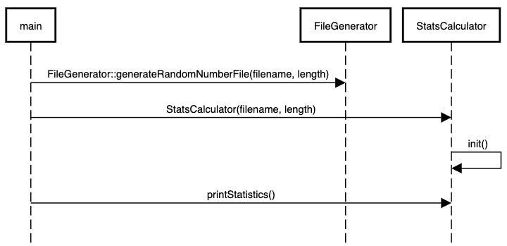

= Programming Assignment 2, S2022
:author: Keith Lancaster, Ph.D.
:icons: font

== Learning Targets
* (CORE) I can use makefiles to manage projects
* (CORE) I can correctly use C++ I/O for terminal and file operations
* I can write code that demonstrates an understanding of separation of concerns
* I can use vectors to manage large data sets

=== Research Requirements
This assignment requires you to research the following topics:

* static functions
* generating random numbers in C++
* the `uint32_t` data type

== Getting Started

1.	Accept the assignment invitation. This will create a repository in your account.
2.  Log in to your Github account if you have not already.
3.  Copy the clone URL.
4.  In a terminal on your computer, change directories into a directory where you want to keep your projects.
5.  Type ```git clone ``` and then paste in your clone URL and hit enter. This will create a new directory containing your assignment.
6.	cd into your new assignment directory.
7.	Complete the assignment as described below.


== Grading
Grading for this assignment is based on the following criteria. Each criteria is graded as _acceptable_ or _revision required_. No partial credit is given. You are allowed one revision after the initial assignment grading. The higher of the two grades will be used as your assignment grade.

[NOTE]
--
Your program must compile without errors (criteria &#35;1 below). If compilation fails, the assignment will receive no credit. You will need to submit a revised version that compiles to receive a grade.
--

|===
|Criteria|Acceptable Work Means...

|Compilation | The program compiles with no errors.
|Standard I/O | Program uses `std::cout` and `std::cin` for standard input and output
|Program Flow | The program must perform operations in the order specified
|Runtime | The program completes without exiting prematurely due to logic errors
|Completeness | All required functionality must be present
|Classes| Classes should conform to the requirements, and be correctly implemented using both h and cpp files
|File I/O| File IO must be performed using C++ streams and not C-type IO methods
|===

== Problem Statement
You are to create a program that 
* generates a file of 1000 random `uint32_t` values using a `static` function 
* reads the generated values into a std::vector
* determines the minimum and maximum values in the file as well as their _location_ in the file
* prints the results in a formatted table

== Design Requirements
The following diagram shows the required design for the program. The notation used here is UML (unified modeling language).




=== Steps

These are _suggested_ steps. It is strongly recommended that you test and compile often as you are completing the program. This might require writing
temporary code in the `main` function, for example. There are many steps that are _not_ listed below, such as adding include directives in files.

1. Create a class called `FileGenerator`. The class should have one _static_ method called `generateRandomNumberFile(std::string filename, int length)`. _Static member functions are covered in chapter 14 of the textbook_.
* This method should create the file `output.txt` and write `length` random numbers to it using the method `arc4random()`. Each number should appear on its own line.
* The data type returned by `arc4random()` is `uint32_t`. Use the web to get more information on this data type.

2. Call the `generateRandomNumberFile` method in your `main` method, passing in the values "output.txt" and 1000 for the file name and length, respectively. 

3. Create a makefile that will compile `main.cpp` and `FileGenerator.cpp` into an executable called `pa2`. Compile and run your program and verify that the output file is correctly being generated.

4. Create the `StatsCalculator` class. The class should have a constructor that takes a filename as a parameter.
* The constructor should 
** store the file name in a private member variable
** call a private method called `init`. This function should open the file (whose name is stored in the private variable) and read in all of its values into a `std::vector`.

5. Create a public function for the `StatsCalculator` class called `printStatistics()`
* This function should print the following table
+
----
Statistics for output.txt
Statistic      Value          Index       
========================================
Minimum        14113913       891            
Maximum        4286965737     469            
----
Of course, the numbers are going to be different from the example, and they will be different every time you run your program.

* You can extract the data needed for the table in two ways: you can use iteration to find values as you would in C, or you can use methods from the standard library. *You can earn 5 extra points on the assignment by using the standard library functions!*


== Submitting the Assignment

When you are ready, type the following commands:
```
git add .
git commit -m “your commit message”
git push origin main
```
In WebCampus, put your Github username and the clone url (see above) in the text field for the submission and submit your assignment.

== Academic Honesty
Academic dishonesty is against university as well as the system community standards. Academic dishonesty includes, but is not limited to, the following:

* Plagiarism: defined as submitting the language, ideas, thoughts or work off another as one's own; or assisting in the act of plagiarism by allowing one's work to be used in this fashion.

* Cheating: defined as (1) obtaining or providing unauthorized information during an examination through verbal, visual or unauthorized use of books, notes, text and other materials; (2) obtaining or providing information concerning all or part of an examination prior to that examination; (3) taking an examination for another student, or arranging for another person to take an exam in one's place; (4) altering or changing test answers after submittal for grading, grades after grades have been awarded, or other academic records once these are official.

Cheating, plagiarism or otherwise obtaining grades under false pretenses constitute academic dishonesty according to the code of this university. Academic dishonesty will not be tolerated and penalties can include cancelling a student’s enrollment without a grade, giving an F for the course, or for the assignment. For more details, see the University of Nevada, Reno General Catalog.
